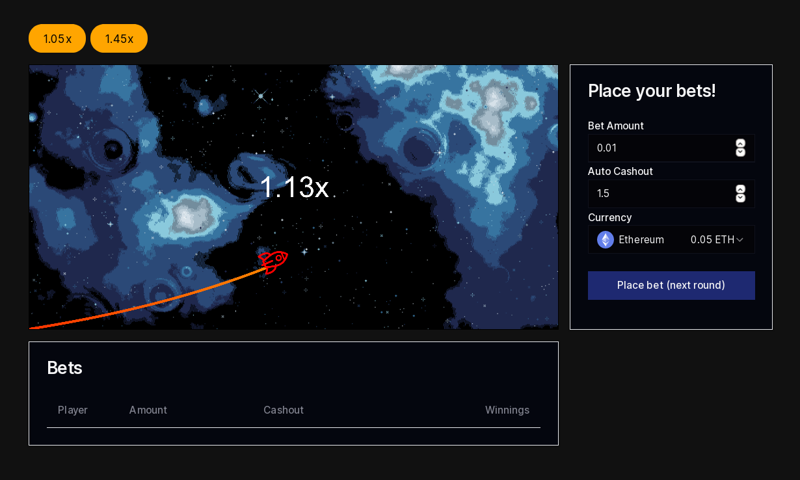

# Crash Game - Frontend [WIP]

## What is this?

This is an implementation of a Provably Fair "Crash" game backed by a
Web3 deposit/treasury contract. There's a rocket that flies through
space and you can win a prize based on how long you wait before cashing
out. If you wait too long and the rocket crashes, you lose your wager.

I'm initially planning to use what is the typical "weak" Provably Fair
mechanism that is usually used by these sorts of games, which guarantees
the result is determined prior to the acceptance of wagers; but I would
like to eventually prove that the crash time selection is fair also
(a task that is somewhat more complicated).

The first version of this will be designed for Ethereum (or L2 chains)
but I'd like to explore creating a real time fully on-chain version on
(say) Solana.

Stack: React/NextJS.

Licence: BSD-2-Clause.

## Running the app

Config values are in `.env`.

```bash
npm run dev
```

## Preview


